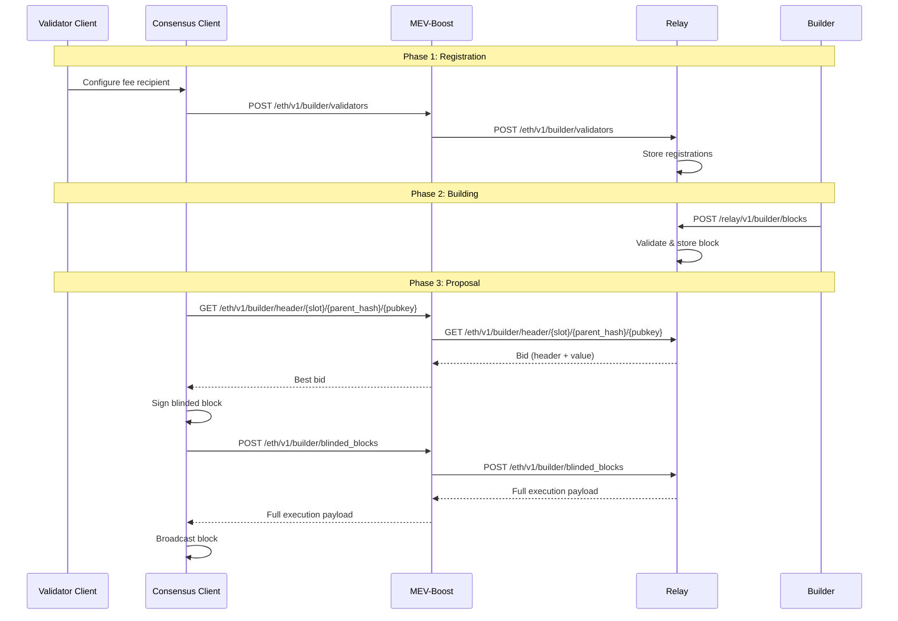

# API Reference

MEV-Boost implements the [Ethereum Builder API Specification](https://ethereum.github.io/builder-specs). This page provides an overview of the API endpoints and their roles in the block proposal flow.

## Builder API (Consensus Client to MEV-Boost)

These endpoints are called by the consensus client and handled by MEV-Boost.

### `POST /eth/v1/builder/validators`

**Register validators** with relays via MEV-Boost.

The consensus client sends a list of validator registrations. MEV-Boost forwards these to all configured relays so they know which validators are using the builder network.

**Request body**: Array of signed validator registrations, each containing:
- `fee_recipient` — Address to receive MEV rewards
- `gas_limit` — Preferred gas limit
- `timestamp` — Registration timestamp
- `pubkey` — Validator public key

```json
[
  {
    "message": {
      "fee_recipient": "0xabcf8e0d4e9587369b2301d0790347320302cc09",
      "gas_limit": "30000000",
      "timestamp": "1234567890",
      "pubkey": "0x93247f2209abcacf57b75a51dafae777f9dd38bc..."
    },
    "signature": "0x1b66ac1fb663c9bc..."
  }
]
```

**Response**: `200 OK` on success.

### `GET /eth/v1/builder/header/{slot}/{parent_hash}/{pubkey}`

**Get the best execution payload header** (bid) for a given slot.

MEV-Boost queries all configured relays (or mux group relays, if applicable) and returns the highest-value valid bid.

**Path parameters**:
- `slot` — The slot number for which to get a header
- `parent_hash` — The parent block hash
- `pubkey` — The proposer's public key

**Response**: The best bid, containing the execution payload header and bid value.

```json
{
  "version": "deneb",
  "data": {
    "message": {
      "header": {
        "parent_hash": "0xcf8e0d4e9587...",
        "fee_recipient": "0xabcf8e0d4e...",
        "block_hash": "0x1234567890ab...",
        "gas_limit": "30000000",
        "gas_used": "15000000",
        "base_fee_per_gas": "1000000000"
      },
      "value": "50956939974241468",
      "pubkey": "0x93247f2209abcacf..."
    },
    "signature": "0x1b66ac1fb663c9bc..."
  }
}
```

### `POST /eth/v1/builder/blinded_blocks`

**Submit a signed blinded block** to retrieve the full execution payload.

After the consensus client signs the winning bid's header, it submits the signed blinded block. MEV-Boost forwards this to the relay that provided the winning bid, which returns the full execution payload.

**Request body**: A signed blinded beacon block containing the execution payload header.

**Response**: The full execution payload, which the consensus client broadcasts to the network.

### `GET /eth/v1/builder/status`

**Check MEV-Boost status**. Returns `200 OK` if the service is running. If `-relay-check` is enabled, it also verifies relay connectivity.

```bash
curl http://localhost:18550/eth/v1/builder/status
```

## Relay Data API

Relays expose a data API for querying delivered payloads, validator registrations, and builder submissions. This is useful for verifying your setup and monitoring relay activity.

### Validator Registration Check

Verify that your validator is registered with a relay:

```
GET /relay/v1/data/validator_registration?pubkey={validator_pubkey}
```

**Example**:

```bash
curl "https://boost-relay.flashbots.net/relay/v1/data/validator_registration?pubkey=0xYOUR_VALIDATOR_PUBKEY"
```

**Response**:

```json
{
  "message": {
    "fee_recipient": "0xabcf8e0d4e9587369b2301d0790347320302cc09",
    "gas_limit": "30000000",
    "timestamp": "1234567890",
    "pubkey": "0x93247f2209abcacf57b75a51dafae777f9dd38bc..."
  },
  "signature": "0x1b66ac1fb663c9bc..."
}
```

### Delivered Payloads

Query recently delivered payloads:

```
GET /relay/v1/data/bidtraces/proposer_payload_delivered
```

Optional query parameters: `slot`, `block_hash`, `block_number`, `proposer_pubkey`, `builder_pubkey`, `limit`, `cursor`.

### Builder Blocks Received

Query blocks submitted by builders:

```
GET /relay/v1/data/bidtraces/builder_blocks_received
```

Optional query parameters: `slot`, `block_hash`, `block_number`, `builder_pubkey`, `limit`.

## Builder API (Builder to Relay)

These endpoints are used by block builders to submit blocks to relays.

### `POST /relay/v1/builder/blocks`

Submit a new block to the relay. The relay validates the block and makes it available for proposers.

### `GET /relay/v1/builder/validators`

Get the list of validators registered with the relay for the current and next epoch. Builders use this to know which slots they can build for.

## Request Flow



## Specifications

- [Builder API Specification](https://ethereum.github.io/builder-specs) — The full Ethereum Builder API spec.
- [Relay API Specification](https://flashbots.github.io/relay-specs/) — Flashbots relay-specific API extensions.
- [Relay Data API](https://flashbots.github.io/relay-specs/) — Data endpoints for querying relay activity.
