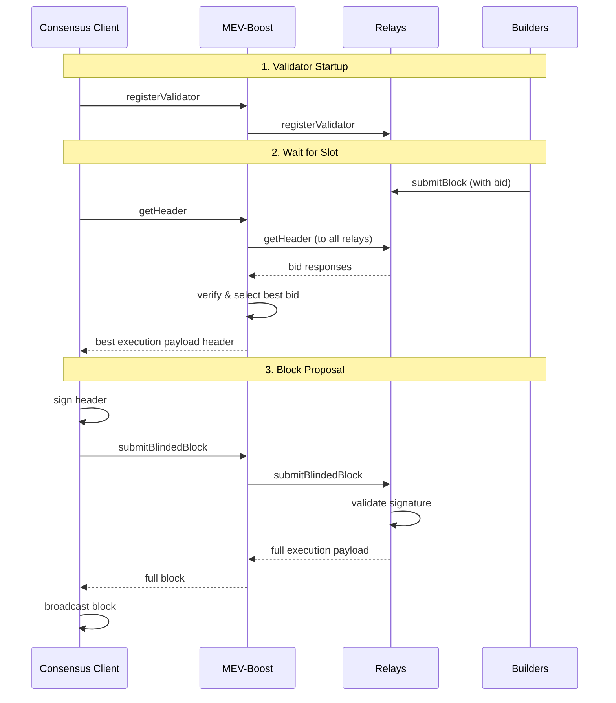

# How MEV-Boost Works

## Background

MEV is a centralizing force on Ethereum. Unattended, the competition for MEV opportunities leads to consensus security instability and permissioned communication infrastructure between traders and block producers. This erodes neutrality, transparency, decentralization, and permissionlessness.

Proposer/block-builder separation (PBS) was initially proposed by Ethereum researchers as a response to the risk that MEV poses to decentralization of consensus networks. They have suggested that uncontrolled MEV extraction promotes economies of scale which are centralizing in nature, and complicate decentralized pooling.

In the future, [proposer/builder separation](https://ethresear.ch/t/two-slot-proposer-builder-separation/10980) will be enshrined in the Ethereum protocol itself to further harden its trust model.

Read more in [Why run MEV-Boost?](https://writings.flashbots.net/writings/why-run-mevboost/) and in the [Frequently Asked Questions](https://github.com/flashbots/mev-boost/wiki/Frequently-Asked-Questions).

## What is MEV-Boost?

`mev-boost` is open source middleware run by validators to access a competitive block-building market. MEV-Boost is an initial implementation of [proposer-builder separation (PBS)](https://ethresear.ch/t/proposer-block-builder-separation-friendly-fee-market-designs/9725) for proof-of-stake (PoS) Ethereum.

With MEV-Boost, validators can access blocks from a marketplace of builders. Builders produce blocks containing transaction orderflow and a fee for the block proposing validator. Separating the role of proposers from block builders promotes greater competition, decentralization, and censorship-resistance for Ethereum.

## Architecture

PoS node operators must run three pieces of software: a **validator client**, a **consensus client**, and an **execution client**. MEV-Boost is a sidecar for the beacon node — a separate piece of open source software, which queries and outsources block-building to a network of builders.

### Block Flow

1. **Block builders** prepare full blocks, optimizing for MEV extraction and fair distribution of rewards. They submit their blocks to relays.
2. **Relays** aggregate blocks from multiple builders in order to select the block with the highest fees.
3. **MEV-Boost** can be configured by a validator to connect to multiple relays.
4. The **consensus layer client** of a validator proposes the most profitable block received from MEV-Boost to the Ethereum network for attestation and block inclusion.

### Sequence Diagram

## Who Can Run MEV-Boost?

MEV-Boost is a piece of software that any PoS Ethereum node operator (including solo validators) can run as part of their Beacon Client software. It is compatible with any Ethereum consensus client.

See also:
- [MEV-Boost Docker images](https://hub.docker.com/r/flashbots/mev-boost)
- [MEV-Boost Wiki](https://github.com/flashbots/mev-boost/wiki)
- [Builder API Specification](https://ethereum.github.io/builder-specs)

## Security

A MEV-Boost security assessment was conducted on 2022-06-20 by [lotusbumi](https://github.com/lotusbumi). The full audit report is available [here](https://github.com/flashbots/mev-boost/blob/develop/docs/audit-20220620.md).

### Bug Bounty

There is a bug bounty program with rewards up to **$25,000 USD** for critical vulnerabilities. If you find a security vulnerability, please email **security@flashbots.net**. See the [SECURITY file](https://github.com/flashbots/mev-boost/blob/develop/SECURITY.md) for details.

## API

MEV-Boost implements the latest [Builder Specification](https://github.com/ethereum/builder-specs).
