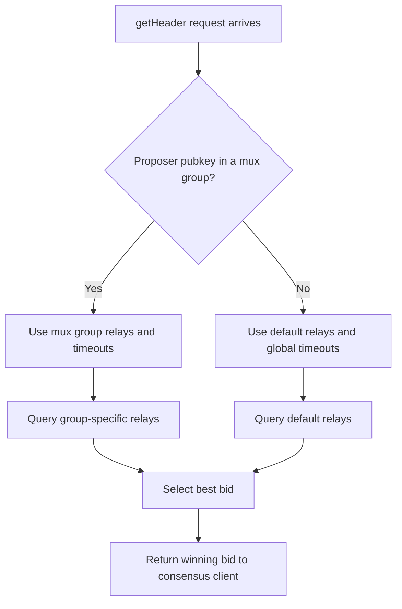

# Relay Multiplexing

**Relay multiplexing** (muxing) allows node operators running multiple validators to route `getHeader` requests to different relay sets per validator group. This is useful when different validators have different relay preferences — for example, Lido validators using one set of relays while Rocket Pool validators use another.

:::info
Relay multiplexing was introduced in **MEV-Boost v1.12**. Make sure you're running v1.12 or later to use this feature.
:::

## Overview

Without muxing, all validators share the same relay configuration. With muxing, you define **mux groups** — each group specifies:

- A unique group ID
- A list of validator public keys
- A dedicated set of relays (with optional per-relay timing games)
- Optional per-group timeout overrides

Each validator pubkey can belong to **at most one** mux group. Validators not assigned to any group use the default (top-level) relay configuration.

## Configuration

Relay muxing is configured in the YAML config file, passed via the `-config` flag:

```bash
./mev-boost -config config.yaml -relay-check
```

### Basic Example

```yaml
# Default relays for validators not in any mux group
relays:
  - url: https://0xPUBKEY@default-relay.example.com

# Mux groups
mux:
  - id: "lido"
    validator_pubkeys:
      - "0x8a1d7b8dd64e0aafe7ea7b6c95065c9364cf99d..."
      - "0x8b1d7b8dd64e0aafe7ea7b6c95065c9364cf99d..."
    relays:
      - url: https://0xPUBKEY@lido-relay-a.example.com
      - url: https://0xPUBKEY@lido-relay-b.example.com

  - id: "rocket-pool"
    validator_pubkeys:
      - "0x8d1d7b8dd64e0aafe7ea7b6c95065c9364cf99d..."
    relays:
      - url: https://0xPUBKEY@rocketpool-relay.example.com
```

### With Timing Games and Timeout Overrides

Each mux group can have its own timeout settings and per-relay timing game configuration:

```yaml
# Global timeouts (used as defaults)
timeout_get_header_ms: 950
late_in_slot_time_ms: 2000

relays:
  - url: https://0xPUBKEY@default-relay.example.com

mux:
  - id: "aggressive"
    validator_pubkeys:
      - "0x8a1d7b..."
    # Per-group timeout overrides
    timeout_get_header_ms: 900
    late_in_slot_time_ms: 1500
    relays:
      - url: https://0xPUBKEY@fast-relay.example.com
        enable_timing_games: true
        target_first_request_ms: 200
        frequency_get_header_ms: 100

  - id: "conservative"
    validator_pubkeys:
      - "0x8d1d7b..."
    # Uses global timeout defaults
    relays:
      - url: https://0xPUBKEY@stable-relay.example.com
        enable_timing_games: false
```

## Configuration Reference

### Mux Group Fields

| Field | Required | Description |
|-------|----------|-------------|
| `id` | Yes | A unique identifier for the mux group (used in logs). |
| `validator_pubkeys` | Yes | List of validator public keys assigned to this group. |
| `relays` | Yes | List of relay configurations for this group. |
| `timeout_get_header_ms` | No | Override the global `getHeader` timeout for this group. |
| `late_in_slot_time_ms` | No | Override the global late-in-slot threshold for this group. |

### Relay Fields (within a mux group)

Each relay in a mux group supports the same fields as top-level relays:

| Field | Required | Description |
|-------|----------|-------------|
| `url` | Yes | Relay URL in `scheme://pubkey@host` format. |
| `enable_timing_games` | No | Enable timing games for this relay (default: `false`). |
| `target_first_request_ms` | No | Target time for first `getHeader` request (requires timing games). |
| `frequency_get_header_ms` | No | Interval between subsequent requests (requires timing games). |

## How It Works



When a `getHeader` request arrives:

1. MEV-Boost checks if the proposing validator's pubkey belongs to a mux group.
2. If yes, it uses that group's relay set and timeout configuration.
3. If no, it falls back to the default (top-level) relay and timeout configuration.
4. The best bid is selected and returned as normal.

## Hot Reloading

Mux configuration supports hot reloading with the `-watch-config` flag. This allows you to add or modify mux groups without restarting MEV-Boost:

```bash
./mev-boost -config config.yaml -watch-config
```

When the config file changes, MEV-Boost reloads the mux group definitions, relay assignments, and timeout overrides.

## Tips

- **One group per validator** — A validator pubkey can only be in one mux group. If a pubkey appears in multiple groups, the config will fail to load.
- **Default relays still matter** — Validators not in any mux group use the top-level `relays` list, so make sure it's configured.
- **Test with `-relay-check`** — Use the `-relay-check` flag to verify all relay URLs (in all groups) are reachable on startup.
- **Use meaningful IDs** — Group IDs appear in logs, making it easier to debug relay behavior per group.

## Further Reading

- [Timing Games](./timing-games) — Configure per-relay timing game parameters within mux groups.
- [Full example config file](https://github.com/flashbots/mev-boost/blob/develop/config.example.yaml)
- [v1.12 Release Notes](./releases#v112) — Original release introducing relay muxing.
