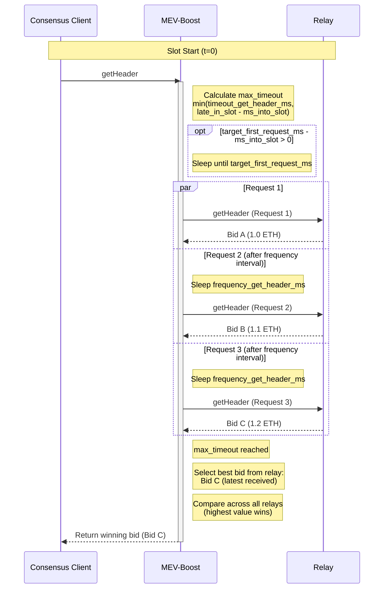

# Timing Games

The **Timing Games** feature allows `mev-boost` to optimize block proposal by strategically timing `getHeader` requests to relays. Instead of sending a single request immediately, it can delay the initial request and send multiple follow-up requests to capture the latest, most valuable bids before the proposal deadline.

:::warning
This feature is strictly meant for advanced users. Extra care should be taken when setting up timing game parameters.
:::

## Configuration

To enable timing games, provide a YAML configuration file using the `-config` flag:

```bash
./mev-boost -config config.yaml
```

To enable hot reloading of the configuration file (changes apply without restarts), add the `-watch-config` flag:

```bash
./mev-boost -config config.yaml -watch-config
```

## Global Timeouts

These settings apply to all relays and define the hard boundaries for the `getHeader` operation.

| Parameter | Default | Description |
|-----------|---------|-------------|
| `timeout_get_header_ms` | `950` | Maximum timeout in milliseconds for `getHeader` requests to relays. |
| `late_in_slot_time_ms` | `2000` | Safety threshold in milliseconds. If a request arrives after this point in a slot, relay requests are skipped and local block building is forced. |

## Per-Relay Configuration

These parameters are configured individually for each relay in `config.yaml`.

| Parameter | Default | Description |
|-----------|---------|-------------|
| `enable_timing_games` | `false` | Enables timing games logic for this relay. If `false`, standard single-request behavior is used. |
| `target_first_request_ms` | — | Target time in milliseconds into the slot when the first `getHeader` request should be sent. Only used when `enable_timing_games` is `true`. |
| `frequency_get_header_ms` | — | Interval in milliseconds between subsequent requests to the same relay. After the first request, `mev-boost` sends new requests at this interval until the timeout budget is exhausted. |

## Example Configuration

```yaml
# Global timeouts
timeout_get_header_ms: 950
late_in_slot_time_ms: 2000

relays:
  # Relay with timing games enabled
  - url: https://0xPUBKEY@relay.example.com
    enable_timing_games: true
    target_first_request_ms: 200
    frequency_get_header_ms: 100

  # Relay with standard behavior (single immediate request)
  - url: https://0xPUBKEY@relay2.example.com
    enable_timing_games: false
```

## Relay Multiplexing (Muxing)

Timing games can be combined with **relay multiplexing**, which allows different validators to use different relay sets for `getHeader` requests. Each validator pubkey can belong to at most one mux group.

```yaml
mux:
  - id: "group-a"
    validator_pubkeys:
      - "0x8a1d7b8dd64e0aafe7ea7b6c95065c9364cf99d..."
      - "0x8b1d7b8dd64e0aafe7ea7b6c95065c9364cf99d..."
    # Optional per-group overrides (fall back to global defaults)
    timeout_get_header_ms: 900
    late_in_slot_time_ms: 1500
    relays:
      - url: https://0xPUBKEY@group-a-relay.example.com
        enable_timing_games: true
        target_first_request_ms: 200
        frequency_get_header_ms: 100

  - id: "group-b"
    validator_pubkeys:
      - "0x8d1d7b8dd64e0aafe7ea7b6c95065c9364cf99d..."
    relays:
      - url: https://0xPUBKEY@group-b-relay.example.com
```

## How It Works



### Step-by-Step

1. **Calculate budget** — When a `getHeader` request arrives, MEV-Boost calculates the maximum time budget as `min(timeout_get_header_ms, late_in_slot_time_ms - ms_into_slot)`.

2. **Delay first request** — If `target_first_request_ms` is set, MEV-Boost waits until that target time before sending the first request.

3. **Send multiple requests** — If `frequency_get_header_ms` is set, MEV-Boost sends multiple requests at that interval until the budget is exhausted.

4. **Best bid selection** — From all responses received, MEV-Boost selects the most recently received bid from each relay, then compares across relays to return the highest value bid.

## Further Reading

- [Full example config file](https://github.com/flashbots/mev-boost/blob/develop/config.example.yaml)
- [Timing Games source code](https://github.com/flashbots/mev-boost/blob/develop/docs/timing-games.md)
